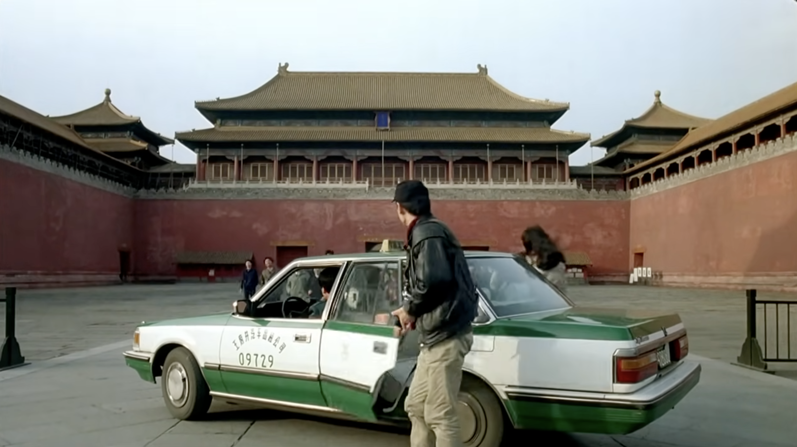
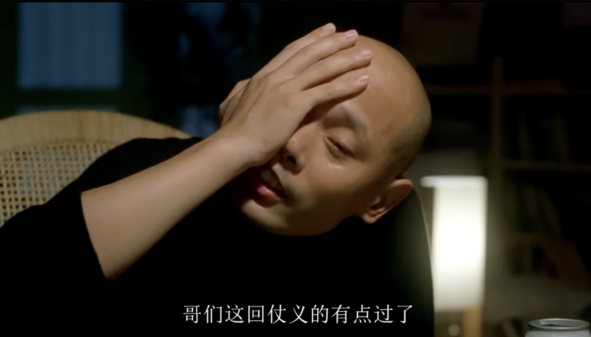

## 葛优与北京 葛优式人物与电影：在市井幽默中浮沉的时代人生

小说三要素分别是人物、情节与环境。有的作品以情节为核心，人物性格与环境设置皆服务于故事推进；而另一些则以人物为主线，情节与环境的设置皆围绕人物成长与性格展开。我个人更偏爱后者这类塑造鲜活人物、描摹内心曲折的作品，因为总觉得在讲故事的作品中作者意志太过强烈，各种巧妙安排的同时又有点不真实。而葛优电影，正是围绕人物的典型，兼具真实感的同时，又刻画了鲜明的人物形象。

葛优主演的电影，大多将背景设定于拍摄当时当地的中国——1990至2000年代的城市社会，尤其是北京。那是一个充满变革与矛盾的时代，改革开放如火如荼，市场经济初现活力但仍杂乱无章；社会秩序尚未稳定，同时又欣欣向荣，充满可能。

北京，作为当时全国最前卫、文化最活跃的城市。在《甲方乙方》中，人们对创业抱有热情；在《大撒把》中，对“出国梦”怀有无限向往；在《非诚勿扰》中，亲密关系开放自由；而在《上一当》与《没完没了》中，则可见社会制度尚不完善、社会治安不严的现象。电影中出现的不仅是当时当地的北京城市，还同时是那个时代北京市民的精神面貌。

在那个特定的时空中，老师可以和学生一起抽烟吃火锅，出国就意味着音信杳无，“下海”创业则可能一夜暴富；出租车能开进故宫，违法行为也时常得过且过。加之当时拍摄技术尚未成熟，后期配音略显粗糙，演员表演带有一定的舞台痕迹，却无意间还原了一个朴素、粗粝而真实的“记忆中的北京”。

虽然笔者未曾亲历那个时代，只能在只言片语的影像与文字中，想象那一个思想开放不输香港，行为自由不逊东京的历史帝都，文化界的多元激荡，平民百姓的机智幽默，基层官僚的有人情味……相较于当下上海的纸醉金迷、物欲横流，那个北京仿佛更贴近某种温情和生活的本真。

在情节上，葛优扮演的小人物总是莫名其妙被卷入一场意外事件：或是临时顶班当高中老师，或是妻子出国杳无音信，或是老板朋友欠钱不还，或是婚姻风波不断……总是些不靠谱的朋友带来些不靠谱的事情作为开头。在过程中总又能遇到意外的女主角，从互相看不顺眼，在慢慢磨合中暗生情愫，最后走到一起。

在各种故事中，有时他用小聪明化解危机，有时用歪理说服对方，有时流露出柔情和细腻，有时则耍贫犯贱逗人一笑。他所呈现的人物形象，总是那么幽默风趣、圆滑世故，面对权力与制度敢于嬉笑怒骂，面对生活则时而颓废、时而又拼尽全力。

虽然整体上是有一个主线框架，但具体到桥段更像是单元剧，在一个个小故事中展现小聪明，在整体上又往往充满了对生活的无力，暗含大智慧。最典型的便是看似葛优在各种地方变着花的赚钱，想着法的讨人欢喜，但忙完了一大圈不过竹篮打水，没赚到多少钱倒搭了一笔进去，终得女主芳心临门一脚时又选择离开。说到底，他本来就并不真的相信能“获得成功”“改变命运”，不过是得过且过，乐呵一阵是一阵，仗义一时是一时。

相较于一些同样以现实为题材的电影，葛优所呈现的生活态度显得更加真实，也更可能被我们说学习。那些诸如“好好学习就能成功”“勇敢追求诗和远方”“知心的朋友和可信的恋人终将出现”“扼住命运的咽喉”之类的主流叙事，听起来总是正确，却也空洞得像废话。人生的转折点是可遇不可求的，贵人相助也更多只存在于梦境中，在现实中，更多时候不过是在随波逐流中苟且度日，偶尔调侃几句，幽它一默，偶尔躺平颓废，自嘲一笑。不奢求有命运般的邂逅，只是在力所能及之时尽量做到满意即可。

面对形式主义的官僚语言，或是抽象的民族国家观念，或是生活的荒谬无序，葛优式人物选择的不是愤怒对抗，而是圆滑周旋，用插科打诨轻描淡写地化解沉重，用故作正经的歪理搪塞严肃，在不较真中消解了那些令人不适的沉闷。这么一想，还挺符合当下互联网生态的。